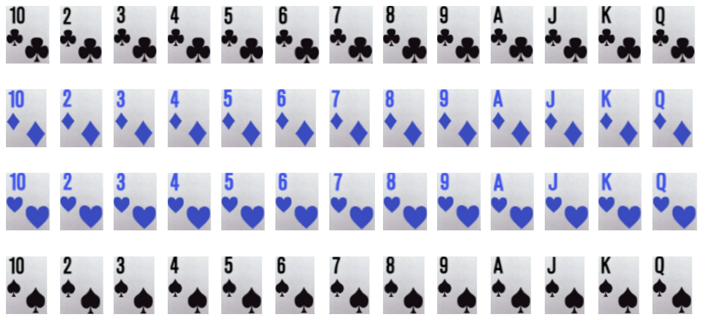

# playing_card_detection

I generated images containing playing cards and trained using [Yolov7](https://github.com/WongKinYiu/yolov7).
I borrowed some ideas of data generation from [geaxgx](https://github.com/geaxgx/playing-card-detection). 

## Table of Contents

- [Requirements](#requirements)
- [How to use this repo](#usage)
- [How it works](#content)

## Requirements

- pytorch
- yolov7
- cv2


## How to use this repo

### Getting the repo
In the working directory, download and go in to the repo.

```shell
git clone git@github.com:masarunakajima/playing_card_detection.git
cd playing_card_detection
```
### Generate dataset
Run data generation script. You can change the numbers of images for 
train, valid, and test. For my project, I used 40000, 2000, 100, respectively.

```shell
python generate_train_data.py --ntrain 1000 --nvalid 100 --ntest 10

```

The generated directory (default name `data`) contains the train, valid, and test images and labels as well as the `data.yaml` file to be used by `yolov7`.

### Train using yolov7
Get `yolov7` in the working directory.
```shell
git clone https://github.com/WongKinYiu/yolov7.git
cd yolov7
```

Run the training script. 
```shell
batch_size=128
data_dir=data
python train.py --workers 8 --epochs 50 --device 0 --batch-size ${batch_size}\
  --data ../${data_dir}/data.yaml --img 600 600 --cfg cfg/training/yolov7.yaml\
  --weights '' --name wsop --hyp data/hyp.scratch.p5.yaml
```


## How it works

In this project, I used the cards used in WSOP Poker, as shown below.
Note that the red is shown in blue.


First I detected the region of interest in each card, namely the rank and suit at the corner of the card.
